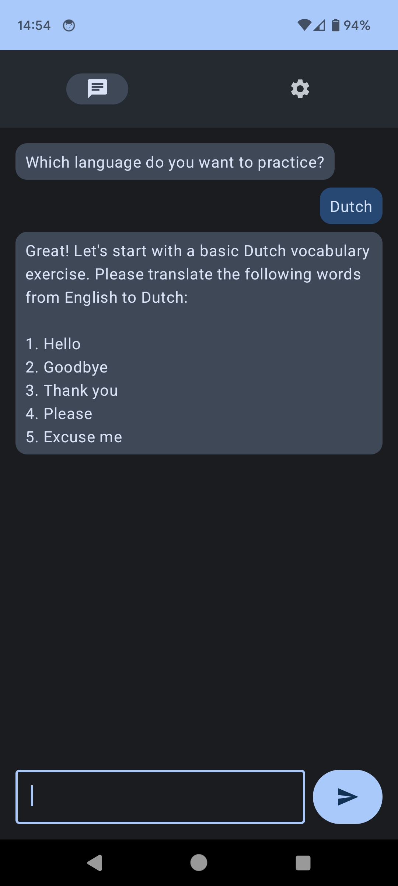

# Android AI Assistant
An OpenAI chatbot for Android



Built using the following libraries:
* [Jetpack Compose](https://developer.android.com/jetpack/compose)
* [Retrofit](https://square.github.io/retrofit)
* [Kotlin Serialization](https://kotlinlang.org/docs/serialization.html#example-json-serialization)
* [Kotlin Serialization Converter](https://github.com/JakeWharton/retrofit2-kotlinx-serialization-converter)

## Getting Started
1. Clone the repo
2. Generate an OpenAI API key at [https://platform.openai.com/api-keys](https://platform.openai.com/api-keys)
3. Add the API key to your `local.properties` file:
  ```
  OPENAI_API_KEY="abcd..."
  ```
4. Build and run the app